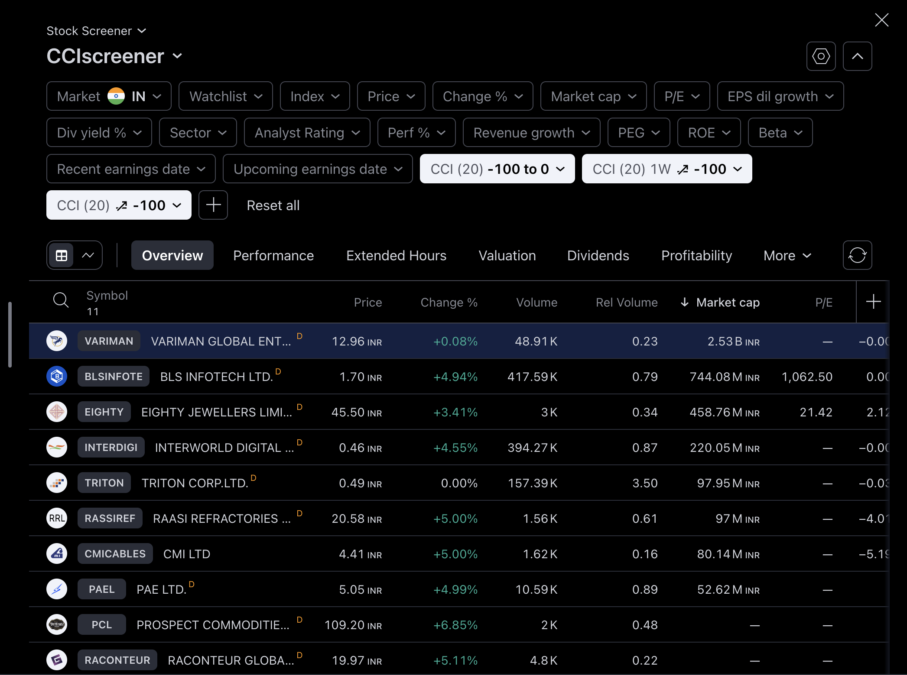

# StockScreenerJava
LONG only: NSE, BSE screener for Intraday and Short Terms : 1H / 4H / 1D

## How to Run

- Clone the repository.
  
  ```shell
  git clone https://github.com/anurag-sachan/StockScreenerJava.git
  ```

- Pre-requisites :
  
    > Install and setup Java
    > 
    > Navigate to TradingViewApi.java
    > 
    > run main()
    > 
    > manually filter for CCI20|4H / CCI1H20|1H for Sniper Entry.


## Screenshot: What it does?

  > Applies CCI filter biased for buying along w/ Momentum.
  > 
  > Good Risk Management, Better Win Percentage, Best RR ratio.
  > 
  > Works fine for smaller time frames: 15M/ 1H/ 4H/ 1D.

 
